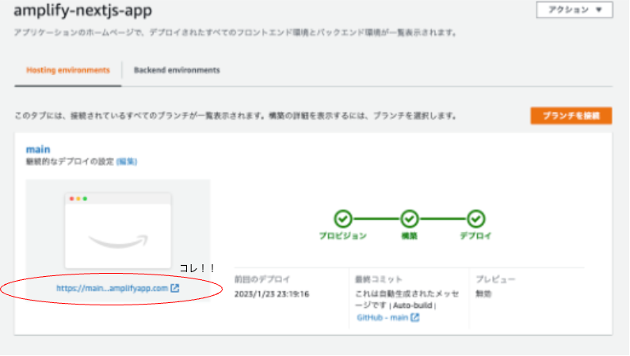

## Amplify-Cli 作成

詳しくは、[公式チュートリアル](https://docs.amplify.aws/start/getting-started/installation/q/integration/next/#option-2-follow-the-instructions)で見ていただきたいんですが、npm を使う場合であれば以下のコマンドでインストールします。

```
npm install -g @aws-amplify/cli
```

## 雛形作成

以下のコマンドで雛形を作成する

```
npx create-next-app amplifynextjsapp
```

Typescript 使うなら、こちらのコマンドを実行する

```
npx create-next-app amplifynextjsapp --typescript
```

## 初期設定

amplify init で初期設定を行う

```
$ amplify init
Note: It is recommended to run this command from the root of your app directory
? Enter a name for the project amplifynextjsapp
The following configuration will be applied:

Project information
| Name: amplifynextjsapp
| Environment: dev
| Default editor: Visual Studio Code
| App type: javascript
| Javascript framework: react
| Source Directory Path: src
| Distribution Directory Path: build
| Build Command: npm run-script build
| Start Command: npm run-script start

? Initialize the project with the above configuration? No
? Enter a name for the environment main
? Choose your default editor: Visual Studio Code
? Choose the type of app that you're building javascript
Please tell us about your project
? What javascript framework are you using react
? Source Directory Path:  src
? Distribution Directory Path: build
? Build Command:  npm run-script build
? Start Command: npm run-script start
Using default provider  awscloudformation
? Select the authentication method you want to use: AWS profile

```


## 認証機能を作成

amplify add auth で認証機能を作成する

```
$ amplify add auth
Using service: Cognito, provided by: awscloudformation

 The current configured provider is Amazon Cognito.

 Do you want to use the default authentication and security configuration? Default configuration
 Warning: you will not be able to edit these selections.
 How do you want users to be able to sign in? Username
 Do you want to configure advanced settings? No, I am done.
✅ Successfully added auth resource amplifynextjsappea7ae9a9 locally

✅ Some next steps:
"amplify push" will build all your local backend resources and provision it in the cloud
"amplify publish" will build all your local backend and frontend resources (if you have hosting category added) and provision it in the cloud
```

amplify status でステータスを確認してみましょう。

ちゃんと Auth が Create になってますね。

```
amplify status

    Current Environment: main

┌──────────┬──────────────────────────┬───────────┬───────────────────┐
│ Category │ Resource name            │ Operation │ Provider plugin   │
├──────────┼──────────────────────────┼───────────┼───────────────────┤
│ Auth     │ amplifynextjsappea7ae9a9 │ Create    │ awscloudformation │
└──────────┴──────────────────────────┴───────────┴───────────────────┘
```

では、amplify push しておきましょう。

こうすることで、ローカルでのカテゴリー(Auth, Api, Funciton...)の変更(Create, Update, Delete)をクラウド側に反映させることができます。

```
amplify push
✔ Successfully pulled backend environment main from the cloud.

    Current Environment: main

┌──────────┬──────────────────────────┬───────────┬───────────────────┐
│ Category │ Resource name            │ Operation │ Provider plugin   │
├──────────┼──────────────────────────┼───────────┼───────────────────┤
│ Auth     │ amplifynextjsappea7ae9a9 │ Create    │ awscloudformation │
└──────────┴──────────────────────────┴───────────┴───────────────────┘
? Are you sure you want to continue? Yes
⚠️ Amplify CLI now supports verifying a Cognito user email address that has been changed and will automatically update your auth configuration. Read more: https://docs.amplify.aws/lib/auth/manageusers/q/platform/js/#updating-and-verifying-a-cognito-user-email-address

Deployment completed.
...

```

これでユーザープールができたはずです。

[Amazon Cognito](https://ap-northeast-1.console.aws.amazon.com/cognito/v2/idp/user-pools)にアクセスして、確認してみましょう。

## Amplify Hosting の設定

Amplify Hosting を使用すると、GitHub / GitLab / BitBucket などのバージョン管理システムで管理されているブランチごとにアプリケーションを実行することができます。

詳細は、[Amplify Deploy and host app](https://docs.amplify.aws/start/getting-started/hosting/q/integration/next/#set-up-cicd-for-your-app)を読んだり、[Amplify Hosting の Getting started](https://console.aws.amazon.com/amplify/home)を読んで、実践して見てください。

僕の場合は、GitHub を使用しており、GitHub 上で作成したリポジトリと連携して、まずは main ブランチと連携させました。

Amplify Hosting の設定が完了すれば、次の画面になります。ホスティングされたアプリケーションは、赤い丸で囲まれた URL にアクセスすることで確認することができます。

<Space mt={10} />




## 関連記事


## 参考文献

- [Amplify Getting Started](https://docs.amplify.aws/start/getting-started/setup/q/integration/next/)
- [Amplify Hosting Get Started](https://docs.aws.amazon.com/amplify/latest/userguide/getting-started.html)
