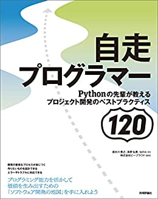

## 1. 自走プログラマー

<BookLink to="https://amzn.to/3ibUg8C">
  自走プログラマー
</BookLink>

### 総評

一般的にシステム開発において良いとされている概念から、Python(特にDjango)を使って開発する上での細かいTipsまでたくさん紹介されていた、という点では良かったです。

<Space mt={2} />

ただし、サンプルコードがPythonなので、当然Pythonを知らなければスムーズに読み進められないはず(Pythonを触ったことがなくても雰囲気は分かるとは思うが...)ですし、出てくるコードもなかなかの量があります。

Pythonに詳しくない方は別の書籍で学んだ方が効率的かもしれないですね。と言っても、代わりになるような良い感じの本があるのかは知りませんが...

### こんな人におすすめ
  この本の前書きにも書いてある通り、「プログラム入門者が中級者にランクアップ」するための本であり、**エンジニア1~2年目くらいの人**が読むべき本だと思います。 

  特に、**Python** + **Django**を使っている(使いたい)人はすごく勉強になると思います！

 